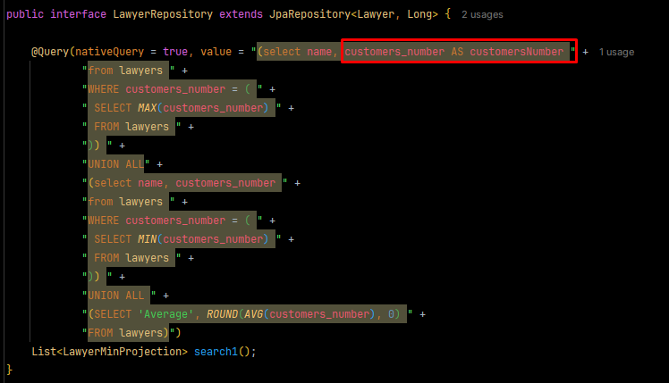

# Estudos de Caso

<!-- TOC -->
* [Estudos de Caso](#estudos-de-caso)
  * [URI 2602 - Elaborando consulta](#uri-2602---elaborando-consulta)
    * [Projeção de Dados (limitação de campo)](#projeção-de-dados-limitação-de-campo)
  * [Convertendo Projection para DTO](#convertendo-projection-para-dto)
    * [2602 - SQL](#2602---sql)
    * [2602 - JPQL](#2602---jpql)
  * [URI 2611 Elaborando a consulta](#uri-2611-elaborando-a-consulta)
    * [2611 - SQL](#2611---sql)
    * [2611 - JPQL](#2611---jpql)
  * [URI 2621 Elaborando a consulta](#uri-2621-elaborando-a-consulta)
    * [2621 - SQL](#2621---sql)
    * [2621 - JPQL](#2621---jpql)
  * [URI 2609 Elaborando a consulta](#uri-2609-elaborando-a-consulta)
    * [2609 - SQL](#2609---sql)
    * [2609 - JPQL](#2609---jpql)
  * [URI 2737 Elaborando a consulta](#uri-2737-elaborando-a-consulta)
  * [URI 2737 Solução alternativa (MAX e MIN)](#uri-2737-solução-alternativa-max-e-min)
  * [URI 2737 - SQL](#uri-2737---sql)
  * [URI 2737 - JPQL](#uri-2737---jpql)
  * [URI 2990 Elaborando a consulta](#uri-2990-elaborando-a-consulta)
  * [URI 2990 Solução alternativa com LEFT JOIN](#uri-2990-solução-alternativa-com-left-join)
  * [U2990 - SQL](#u2990---sql)
  * [U2990 - JPQL](#u2990---jpql)
<!-- TOC -->

## URI 2602 - Elaborando consulta

Busca simples

```sql
SELECT name FROM customers WHERE state = 'RS';
````

### Projeção de Dados (limitação de campo)

Caso a gente queira fazer uma projeção (limitar campos de consulta, acessando somente os campos que precisamos), faremos
o seguinte:

Criaremos um pacote **projections**, com uma interface contendo somente os campos que a gente quer.

```java
public interface CustomerMinProjection {
    String getname();
}
```

E no Repository, podemos criar uma consulta para retornar uma lista de objetos dessa projection, veja:

```java
public interface CustomRepository extends JpaRepository<Customer, Long> {
  //nativeQuery = SQL raíz, não SJPQL
  @Query(nativeQuery = true, value = "SELECT name "
          + "FROM customers "
          + "WHERE UPPER(state) = UPPER(:state)")
  List<CustomerMinProjection> search1(String state);
}

```

❗Importante. Na prática, nós não utilizamos esse Projection e sim um DTO.

## Convertendo Projection para DTO

Criar um pacote DTO e uma classe CustomerMinDTO, contendo:

```java
public class CustomerMinDTO {

    private String name;

    public CustomerMinDTO() {

    }

    public CustomerMinDTO(String name) {
        this.name = name;
    }

    //outro construtor convertendo de Projection para DTO
    public CustomerMinDTO(CustomerMinProjection projection) {
        name = projection.getname();
    }


    public String getName() {
        return name;
    }

    public void setName(String name) {
        this.name = name;
    }

    @Override
    public String toString() {
      return "CustomerMinDTO{" +
              "name='" + name + '\'' +
              '}';
    }
}
```

Na classe Application, podemos implementar o CommandLineRunner, e executar a consulta!

```java
@SpringBootApplication
public class Uri2602Application implements CommandLineRunner {

    //repository importado
  @Autowired
  private CustomRepository customRepository;

  public static void main(String[] args) {
    SpringApplication.run(Uri2602Application.class, args);
  }

  @Override
  public void run(String... args) throws Exception {
      
      //lista inicial da projection com a consulta customizada
    List<CustomerMinProjection> list = customRepository.search1("RS");

    List<CustomerMinDTO> result1 = list.stream().map(
            //transformando cada elemento da lista acima em um DTO
            x -> new CustomerMinDTO(x)
    ).collect(Collectors.toList());

    for (CustomerMinDTO obj : result1) {
      System.out.println(obj);
    }
  }
}
```

SOUT console:


### 2602 - SQL

No SQL usamos no Repository a "consulta raiz", conforme pode ser observado no parâmetro do @Query.

### 2602 - JPQL

Já no JPQL, precisamos dar "apelidos" para os nossos objetos, veja:

```java
    /*
    leia-se: "SELECT new (objetos desse tipo 👇 + o nome do construtor
    customizado que criamos. "obj.name" pois o apelido que damos para
    cada objeto que vamos buscar, é obj.
    */
    @Query("SELECT new com.devsuperior.uri2602.dto.CustomerMinDTO(obj.name) "
    + "FROM Customer obj "
    + "WHERE upper(obj.state) = upper(:state) ")
    List<CustomerMinDTO> search2(String state);
```

Fica um pouco verboso, pois precisamos instanciar com new ali em cima, utilizando a classe do DTO.

Na classe application:

```java
		List<CustomerMinDTO> result2 = customRepository.search2("rs");
		for (CustomerMinDTO obj : result2) {
			System.out.println(obj);
		}
```

SOUT:


<hr>

## URI 2611 Elaborando a consulta

Join Simples

```sql
select movies.id, movies.name
FROM movies
INNER JOIN genres ON movies.id_genres = genres.id
WHERE genres.description = 'Action';
```

### 2611 - SQL

Criação do Repository com o método SQl, sendo o mesmo este:

```java
public interface MovieRepository extends JpaRepository<Movie, Long> {

    @Query(nativeQuery = true, value = "SELECT movies.id, movies.name "
    + "FROM movies "
    + "INNER JOIN genres ON movies.id_genres = genres.id "
    + "WHERE genres.description = :genreName")
    List<MoviesMinProjection> search1(String genreName);
}
```

Criação da Projection

```java
public interface MoviesMinProjection {
    Long getId();
    String getName();
}
```

Código Application:
```java
	@Override
	public void run(String... args) throws Exception {
		List<MoviesMinProjection> list = movieRepository.search1("Action");
		
		List<MovieMinDTO> result = list.stream().map(
				x -> new MovieMinDTO(x)
		).collect(Collectors.toList());

		for (MovieMinDTO obj : result) {
			System.out.println(obj);
		}
	}
```

SOUT:


### 2611 - JPQL

No Repository, usaremos a query diferente conforme já aprendemos, veja:

```java
    @Query("SELECT new com.devsuperior.uri2611.dto.MovieMinDTO(obj.id, obj.name) "
    + "FROM Movie obj "
    + "WHERE obj.genre.description = :genreName ")
    List<MovieMinDTO> search2(String genreName);
```

Fica bem menos verboso, pois podemos acessar o genre direto no obj! Lembre-se: o obj, na verdade, é a classe Movie,
então podemos navegar nos seus atributos. Como ela possui o genre pela relacinamento entre eles, fica mais fácil.

Na Application:

```java
		List<MovieMinDTO> result2 = movieRepository.search2("Action");

		for (MovieMinDTO obj : result2) {
			System.out.println(obj);
		}
```

SOUT:


<hr>

## URI 2621 Elaborando a consulta

Like e Between.

```sql
SELECT products.name
FROM products
INNER JOIN providers ON products.id_providers = providers.id
where products.amount BETWEEN 10 AND 20
AND providers.name LIKE 'P%';
```

### 2621 - SQL

Criação da Projection. Como o retorno do exercício é string (name), retornaremos somente isso:

```java
public interface ProductMinProjection {

    String getName();
}

```

Criação do repository contendo método search:

```java
    @Query(nativeQuery = true, value = "SELECT products.name "
    + "FROM products "
    + "INNER JOIN providers ON products.id_providers = providers.id "
    + "WHERE products.amount BETWEEN :min AND :max "
    + "AND providers.name LIKE CONCAT(:beginName, '%')")
    List<ProductMinProjection> search1(Integer min, Integer max, String beginName);
```

Criar DTO + construtor de conversão, conforme visto acima.

Na application:

```java
	@Override
	public void run(String... args) throws Exception {

		List<ProductMinProjection> list1 = repository.search1(10, 20,"P");

		List<ProductMinDTO> result = list1.stream().map(x -> new ProductMinDTO(x)).collect(Collectors.toList());

		for (ProductMinDTO obj : result) {
			System.out.println(obj);
		}

	}
```

SOUT:


### 2621 - JPQL

Consulta no repository:

```java
    @Query("SELECT new com.devsuperior.uri2621.dto.ProductMinDTO(obj.name) "
    + "FROM Product obj "
    + "WHERE obj.amount BETWEEN :min and :max "
    + "AND obj.provider.name LIKE CONCAT(:beginName, '%') ")
    List<ProductMinDTO> search2(Integer min, Integer max, String beginName);
```

Application:

```java
		List<ProductMinDTO> result2 = repository.search2(10, 20, "P");
		for (ProductMinDTO obj : result2) {
			System.out.println(obj);
		}
```

SOUT:


<hr>

## URI 2609 Elaborando a consulta

Sobre Group By

```sql
Select categories.name, SUM(products.amount) as sum
From Categories
INNER JOIN products ON products.id_categories = categories.id

usar group by pra juntar os valores repetidos
GROUP BY categories.name
```

### 2609 - SQL

Mesmo de sempre, criar os pacotes de DTO e Projections.

No repository:
```java
    @Query(nativeQuery = true, value = "SELECT categories.name, SUM(products.amount) as sum "
    + "FROM Categories "
    + "INNER JOIN products ON products.id_categories = categories.id "
    + "GROUP BY categories.name")
    List<CategorySumProjection> search1();
```

Application:
```java
	@Override
	public void run(String... args) throws Exception {

		List<CategorySumProjection> list1 = repository.search1();
		List<CategorySumDTO> result1 = list1.stream().map(x -> new CategorySumDTO(x)).collect(Collectors.toList());

		for (CategorySumDTO obj : result1) {
			System.out.println(obj);
		}
	}
```

SOUT:


### 2609 - JPQL

Repository:

Muito interessante entendermos essa query e lembrar do relacionamento um pra muitos.

Como um produto pode ter muitas categorias, dentro da entidade Product, temos o relacionamento:

```java
	@ManyToOne
	@JoinColumn(name = "id_categories")
	private Category category;
```

Portanto, ao declarar abaixo o Product como "obj", podemos acessar suas caracteristicas (entidades).

```java
    @Query("SELECT new com.devsuperior.uri2609.dto.CategorySumDTO(obj.category.name, SUM(obj.amount)) "
    + "FROM Product obj "
    + "GROUP BY obj.category.name")
    List<CategorySumDTO> search2();
```

SOUT:


<hr>

## URI 2737 Elaborando a consulta

Sobre União.

Podemos fazer 3 selects e unir cada um com UNION ALL. Se usa UNION ALL porque se fosse somente UNION, casos repetidos
iriam aparecer.

```sql
(select name, customers_number
from lawyers
ORDER BY customers_number DESC
LIMIT 1)

UNION ALL

(select name, customers_number
from lawyers
ORDER BY customers_number ASC
LIMIT 1)

UNION ALL

(SELECT 'Average', ROUND(AVG(customers_number), 0)
FROM lawyers)
```

O campo 'Average' foi criado dessa forma, passando somente no Select.

## URI 2737 Solução alternativa (MAX e MIN)

Uma outra forma de solucionar o exercício acima, é usar MAX e Min. Mas para isso precisaremos fazer uma subconsulta.

Trocaremos o ORDER BY por WHERE e faremos a consulta, ou seja, UM NOVO SELECT (tipo um condicional).

```sql
 (select name, customers_number
  from lawyers
  WHERE customers_number = (
    SELECT MAX(customers_number)
    FROM lawyers
  ))

 UNION ALL

 (select name, customers_number
  from lawyers
  WHERE customers_number = (
    SELECT MIN(customers_number)
    FROM lawyers
  ))

 UNION ALL

 (SELECT 'Average', ROUND(AVG(customers_number), 0)
  FROM lawyers)
```

## URI 2737 - SQL

Dessa vez, para que o nosso programa identifique a coluna customers_number, em virtude do "_", precisaremos dar um apelido
a ela na Query, veja:



Na application:

```java
	@Override
	public void run(String... args) throws Exception {
		List<LawyerMinProjection> search1 = repository.search1();
		List<LawyerMinDTO> result = search1.stream().map(x -> new LawyerMinDTO(x)).collect(Collectors.toList());

		for (LawyerMinDTO obj : result) {
			System.out.println(obj);
		}

	}
```

SOUT: Ele fará tudo + as Unions certinho!


## URI 2737 - JPQL

Até a presente data do curso, não existe nenhuma união no JPQL. Poderia ser feito de outra forma equivalente, mas não
valeria a pena.

<hr>

## URI 2990 Elaborando a consulta

Este estudo de caso será sobre: diferença / left join


Nessa imagem, por exemplo, a diferença entre o conjunto A com o B é a parte que está marcada. Circulo A menos a
intersecção do A com B. Intersecção = inner join.

A ideia é selecionar os elementos do conjunto A, descontando os que estariam no inner join (elementos em comum com o B.)

Exemplo de código onde fazemos o inner join:

```sql
SELECT empregados.cpf, empregados.enome, departamentos.dnome
FROM empregados
INNER JOIN departamentos ON empregados.dnumero = departamentos.dnumero
INNER JOIN trabalha ON trabalha.cpf_emp = empregados.cpf
INNER JOIN projetos ON trabalha.pnumero = projetos.pnumero
```

O que queremos é o oposto, queremos os empregados que não estão em nenhum projeto.

Nós usaremos WHERE + NOT IN para filtrar quem não está na tabela "trabalha"


```sql
SELECT empregados.cpf, empregados.enome, departamentos.dnome
FROM empregados
INNER JOIN departamentos ON empregados.dnumero = departamentos.dnumero
WHERE empregados.cpf NOT IN (
	SELECT empregados.cpf 
	FROM empregados
	INNER JOIN trabalha ON trabalha.cpf_emp = empregados.cpf
)
```

## URI 2990 Solução alternativa com LEFT JOIN

O left join traria os elementos em verde e também os elementos que estão em comum com B (marcação laranja acima).
E depois, o que podemos fazer é restringir os elementos que estão igual a nulo, veja:

```sql
SELECT empregados.cpf, empregados.enome, departamentos.dnome, trabalha.*
FROM empregados
INNER JOIN departamentos ON empregados.dnumero = departamentos.dnumero
LEFT JOIN trabalha ON trabalha.cpf_emp = empregados.cpf
ORDER BY empregados.cpf

```
Se usássemos esse código, ele trará tudo! Inclusive, valores nulos.


Como sabemos que quem está null não trabalha em nenhum local, podemos colocar um Where para restringir isso:

```sql
SELECT empregados.cpf, empregados.enome, departamentos.dnome
FROM empregados
INNER JOIN departamentos ON empregados.dnumero = departamentos.dnumero
LEFT JOIN trabalha ON trabalha.cpf_emp = empregados.cpf

WHERE trabalha.cpf_emp IS NULL
	
ORDER BY empregados.cpf
```

## U2990 - SQL

O de sempre no repository:
```java
    @Query(nativeQuery = true, value = "SELECT empregados.cpf, empregados.enome, departamentos.dnome " +
            " FROM empregados " +
            " INNER JOIN departamentos ON empregados.dnumero = departamentos.dnumero " +
            " LEFT JOIN trabalha ON trabalha.cpf_emp = empregados.cpf " +

            " WHERE trabalha.cpf_emp IS NULL " +

            " ORDER BY empregados.cpf")
    List<EmpregadoDeptProjection> search1();
```

Application fazendo o de sempre das listas + conversão, conforme acima.

SOUT:


## U2990 - JPQL

```java
    @Query("SELECT new com.devsuperior.uri2990.dto.EmpregadoDeptDTO(obj.cpf, obj.enome, obj.departamento.dnome) "
            + "FROM Empregado obj "
            + "WHERE obj.cpf NOT IN ( "
            + "SELECT obj.cpf "
            + "FROM Empregado obj "
            + "INNER JOIN obj.projetosOndeTrabalha "
            + ") "
            + "ORDER BY obj.cpf")
    List<EmpregadoDeptDTO> search2();
```

Mesmo de sempre, ao declarar a entidade como Obj, podemos navegar nela e acessar os outros atributos.

Adendo: Podemos excluir o Inner Join existente:


Pois ao fazer o "obj.departamento.dnome", a JPA já faz o inner join.

Adendo2:


Essa linha foi alterada para "inner join obj.projetosOndeTrabalha", somente isso já irá excluir e selecionaremos
somente os CPFs de empregados que tem relação com Trabalha :).